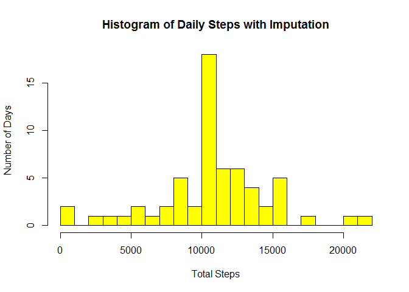

# Activity Analysis - Reproducible Research Assignment 1
Sonia Tripolitano  
26 October 2017  

## Read in data, examine and process


```r
active<-read.csv("activity.csv")
active$date<-as.Date(active$date)
str(active)
```

```
## 'data.frame':	17568 obs. of  3 variables:
##  $ steps   : int  NA NA NA NA NA NA NA NA NA NA ...
##  $ date    : Date, format: "2012-10-01" "2012-10-01" ...
##  $ interval: int  0 5 10 15 20 25 30 35 40 45 ...
```

```r
summary(active)
```

```
##      steps             date               interval     
##  Min.   :  0.00   Min.   :2012-10-01   Min.   :   0.0  
##  1st Qu.:  0.00   1st Qu.:2012-10-16   1st Qu.: 588.8  
##  Median :  0.00   Median :2012-10-31   Median :1177.5  
##  Mean   : 37.38   Mean   :2012-10-31   Mean   :1177.5  
##  3rd Qu.: 12.00   3rd Qu.:2012-11-15   3rd Qu.:1766.2  
##  Max.   :806.00   Max.   :2012-11-30   Max.   :2355.0  
##  NA's   :2304
```

```r
head(active)
```

```
##   steps       date interval
## 1    NA 2012-10-01        0
## 2    NA 2012-10-01        5
## 3    NA 2012-10-01       10
## 4    NA 2012-10-01       15
## 5    NA 2012-10-01       20
## 6    NA 2012-10-01       25
```

Create a summary dataset which sums up the steps by day


```r
summ<-data.frame(tapply(active$steps,active$date,sum))
daily<-data.frame(date=as.Date(names(summ[,1])),steps=as.numeric(summ[1]$tapply.active.steps..active.date..sum.))
str(daily)
```

```
## 'data.frame':	61 obs. of  2 variables:
##  $ date : Date, format: "2012-10-01" "2012-10-02" ...
##  $ steps: num  NA 126 11352 12116 13294 ...
```

```r
summary(daily)
```

```
##       date                steps      
##  Min.   :2012-10-01   Min.   :   41  
##  1st Qu.:2012-10-16   1st Qu.: 8841  
##  Median :2012-10-31   Median :10765  
##  Mean   :2012-10-31   Mean   :10766  
##  3rd Qu.:2012-11-15   3rd Qu.:13294  
##  Max.   :2012-11-30   Max.   :21194  
##                       NA's   :8
```

## Steps taken per day and report mean and median
<!-- -->


*The mean number of steps per day is 10766 and the median is 10765*

## Daily Activity Pattern
### Summarise data to find average steps per interval

```r
active2<-active[complete.cases(active),] # Remove NAs
summ2<-data.frame(tapply(active2$steps,active2$interval,mean)) 
intervals<-data.frame(intervals=as.integer(names(summ2[,1])),steps=as.numeric
                      (summ2[1]$tapply.active2.steps..active2.interval..mean.))
summary(intervals)
```

```
##    intervals          steps        
##  Min.   :   0.0   Min.   :  0.000  
##  1st Qu.: 588.8   1st Qu.:  2.486  
##  Median :1177.5   Median : 34.113  
##  Mean   :1177.5   Mean   : 37.383  
##  3rd Qu.:1766.2   3rd Qu.: 52.835  
##  Max.   :2355.0   Max.   :206.170
```

<!-- -->

*The 5-minute interval which contains the maximum number of steps is 835*

## Imputing missing values

I have established previously that only the "steps" column contains NAs.

*There are 2304 number of rows with missing values*

### Impute missing values using average steps per interval 

```r
names(intervals)<-c("interval","avgsteps") # Change names suitable for merging datasets
active3<-merge(active,intervals,by="interval") 
active3$stepsfilled<-active3$steps # Use average steps per interval for missing values
active3[is.na(active3$steps),]$stepsfilled<-active3[is.na(active3$steps),]$avgsteps
head(active3,20) # Check that imputation is correct
```

```
##    interval steps       date avgsteps stepsfilled
## 1         0    NA 2012-10-01 1.716981    1.716981
## 2         0     0 2012-11-23 1.716981    0.000000
## 3         0     0 2012-10-28 1.716981    0.000000
## 4         0     0 2012-11-06 1.716981    0.000000
## 5         0     0 2012-11-24 1.716981    0.000000
## 6         0     0 2012-11-15 1.716981    0.000000
## 7         0     0 2012-10-20 1.716981    0.000000
## 8         0     0 2012-11-16 1.716981    0.000000
## 9         0     0 2012-11-07 1.716981    0.000000
## 10        0     0 2012-11-25 1.716981    0.000000
## 11        0    NA 2012-11-04 1.716981    1.716981
## 12        0     0 2012-11-08 1.716981    0.000000
## 13        0     0 2012-10-12 1.716981    0.000000
## 14        0     0 2012-10-30 1.716981    0.000000
## 15        0     0 2012-11-26 1.716981    0.000000
## 16        0    47 2012-10-04 1.716981   47.000000
## 17        0     0 2012-11-27 1.716981    0.000000
## 18        0     0 2012-10-31 1.716981    0.000000
## 19        0     0 2012-11-18 1.716981    0.000000
## 20        0     0 2012-10-05 1.716981    0.000000
```

```r
active4<-active3[,c(1,3,5)]
names(active4)[3]<-c("steps")

# Summarise to get the steps per day
summ3<-data.frame(tapply(active4$steps,active4$date,sum))
dailyb<-data.frame(date=as.Date(names(summ3[,1])),steps=as.numeric(summ3[1]$tapply.active4.steps..active4.date..sum.))
```

<!-- -->

*The mean and median total number of steps taken per day is 10766 and 10766*

The mean does not differ from the original since the imputation was done using mean.
The median changes slightly.

## Activity pattern weekdays vs weekends
Create a new dataset with a weekend/ weekday flag

```r
active4$weekday<-weekdays(active4$date)
active4$weekdayflag<-"Weekday"
active4[active4$weekday==c("Sunday","Saturday"),]$weekdayflag<-"Weekend"
head(active4) # Check that flag is correct
```

```
##   interval       date    steps  weekday weekdayflag
## 1        0 2012-10-01 1.716981   Monday     Weekday
## 2        0 2012-11-23 0.000000   Friday     Weekday
## 3        0 2012-10-28 0.000000   Sunday     Weekend
## 4        0 2012-11-06 0.000000  Tuesday     Weekday
## 5        0 2012-11-24 0.000000 Saturday     Weekday
## 6        0 2012-11-15 0.000000 Thursday     Weekday
```

After summarising data to get the steps per interval per weekend/ weekday flag,
create panel plot of Time Series of Avg Daily Steps taken
<!-- -->
